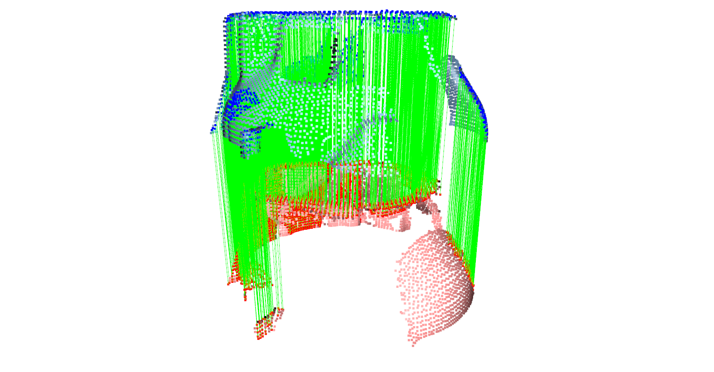

# 3D Point Cloud Registration and Alignment


<p align="center">
  
</p>

## Overview

This repository contains a Python-based implementation for performing 3D point cloud registration and alignment using RANSAC and ICP methods. The project uses the [Open3D](http://www.open3d.org/) library to load, preprocess, register, and visualize point clouds. The goal of this project is to iteratively align multiple point clouds into a single, unified model.

## Features

- **Multiple Point Cloud Registration**: Supports registration of multiple point clouds using RANSAC and ICP.
- **Point Cloud Preprocessing**: Includes filtering, downsampling, and normal estimation.
- **Alignment Filtering**: Filter points based on alignment scores to improve the accuracy of the registration.
- **Visualization**: Visualize intermediate and final results using Open3D's powerful visualization tools.
- **Step-by-Step Processing**: The process is broken down into clear, manageable steps, making it easier to understand and extend.

## Getting Started

### Prerequisites

- **Python 3.8+**
- **Open3D 0.11.2**
- **NumPy 1.19.5**
- **Pandas 1.1.5**
- **Matplotlib 3.3.4**

You can install the necessary dependencies using pip:

```bash
pip install -r requirements.txt
