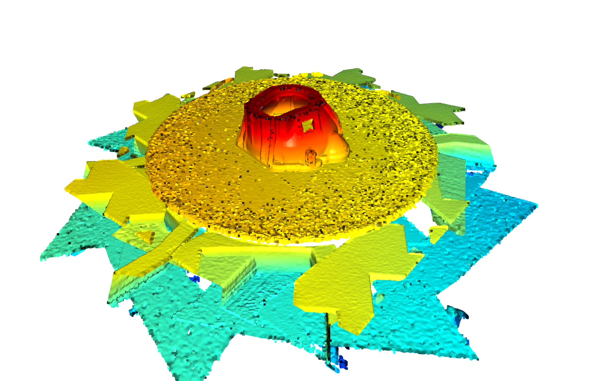

# 3D Point Cloud Registration and Alignment


<p align="center">
  
  
</p>

## Overview

This repository contains a Python-based implementation for performing 3D point cloud registration and alignment using RANSAC and ICP methods. The project uses the [Open3D](http://www.open3d.org/) library to load, preprocess, register, and visualize point clouds. The goal of this project is to study and analyze how FPFH RANSAC + ICP aligns multiple point clouds into a single, unified model.

## Features

- **Multiple Point Cloud Registration**: Supports registration of multiple point clouds using RANSAC and ICP.
- **Point Cloud Preprocessing**: Includes filtering, downsampling, and normal estimation.
- **Alignment Filtering**: Filter points based on alignment scores to improve the accuracy of the registration.
- **Visualization**: Visualize intermediate and final results using Open3D's powerful visualization tools.
- **Step-by-Step Processing**: The process is broken down into clear, manageable steps, making it easier to understand and extend.

### Data Requirements

- **Point Cloud Files**: 
  - The point cloud files must be in `.pcd` format and should ideally follow a naming convention such as `[xxx].pcd`, where `xxx` is a zero-padded integer (e.g., `001.pcd`, `002.pcd`). 
  - Ensure that the data directory in the script is correctly configured to point to the location of your `.pcd` files.

- **Viewpoint Poses**: 
  - Viewpoint poses should be stored in a `.csv` file, with each row corresponding to the respective `.pcd` file by its order (i.e., the `n`th row matches the `n`th `.pcd` file).
  - The script is designed to process pose data focusing primarily on the pose information.


| timestamp | frame_id | child_frame_id | translation_x | translation_y | translation_z | rotation_x | rotation_y | rotation_z | rotation_w |
|-----------|----------|----------------|---------------|---------------|---------------|------------|------------|------------|------------|
| 63.925    | world    | sensor_frame   | 0.5           | -6.36956e-08  | 0.5           | 0.653282   | 0.653281   | -0.270598  | -0.270598  |
| 81.277    | world    | sensor_frame   | 0.353527      | 0.353364      | 0.500006      | 0.353676   | 0.853504   | -0.353528  | -0.146498  |
| 100.885   | world    | sensor_frame   | 7.05113e-05   | 0.499742      | 0.50001       | 8.11562e-05 | 0.92388    | -0.382682  | -3.82425e-05 |
| 120.517   | world    | sensor_frame   | -0.352529     | 0.352881      | 0.500047      | -0.35328   | 0.853668   | -0.353606  | 0.146311   |
| 141.325   | world    | sensor_frame   | -0.498181     | 0.000345193   | 0.50007       | -0.652982  | 0.653584   | -0.27074   | 0.270448   |
| 159.829   | world    | sensor_frame   | -0.353288     | -0.353152     | 0.500019      | 0.85351    | -0.35366   | 0.146498   | -0.35353   |
| 183.421   | world    | sensor_frame   | -0.000669568  | -0.499646     | 0.499703      | 0.92417    | -0.000850502 | 0.000222446 | -0.381981  |
| 31.045    | world    | sensor_frame   | -0.0702399    | -0.39194      | 0.503894      | 0.92534    | -0.0129243 | -0.0220144 | -0.378278  |


## Files

| File |  Description   |
| ---------------- |  ------------------- |
| pointcloud_viewer.py          |  Simple visualization of point clouds. |
| normals_viewer.py         |  Visualizes alignment score (measurement quality) of the point cloud with respect to the viewpoint.           |
| correspondence_viewer.py         |  Visualizes the correspondences interactively between two point clouds.            |
| simple_registration.py         |  Registers two point clouds with FPFH RANSAC + ICP or optionally only ICP.           |
| complete_registration.py         |  Registers a multiple point clouds into one unified model.          |
| quality_registration.py         |  Registers a multiple point clouds into one unified model while filtering badly measured points.          |

## Getting Started

### Prerequisites

- **Python 3.8+**
- **Open3D 0.11.2**
- **NumPy 1.19.5**
- **Pandas 1.1.5**
- **Matplotlib 3.3.4**

You can install the necessary dependencies using pip:

```bash
pip install -r requirements.txt
